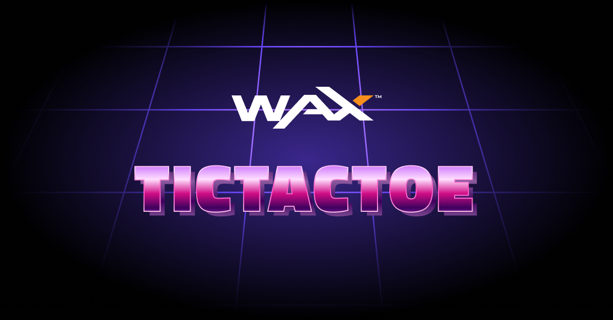

# Tic Tac Toe

## 🎮 Overview


Dive into the timeless classic of Tic Tac Toe, reimagined with the power of Vite for frontend development and the WAXP blockchain for decentralized gameplay. Experience a secure, transparent, and interactive gaming environment where each move resonates on the blockchain.

## 🛠️ Technologies Utilized

- **Vite**: Elevate your development workflow with Vite, a toolset tailored for swift and efficient web project creation.
- **WAXP Blockchain**: Embrace the decentralized ethos with the WAXP blockchain, fostering secure, transparent smart contract interactions for gaming experiences.

## 🚀 Getting Started

### Prerequisites

Ensure the following prerequisites are met before embarking on your journey:

```
Node.js (Version: 16.16.0) or Yarn (Version: 1.22.17) & npm (Version: 9.6.7) installed on your machine.
```

### 📋 Installation & Setup

1. **Clone the Repository**:
```
git clone git@github.com:worldwide-asset-exchange/tic-tac-toe-front-end.git
```

2. **Navigate to the Project Directory**:
```
cd tic-tac-toe-front-end
```

3. **Install Dependencies**:
```
npm install
```
**OR**
```
yarn
```

4. **Configure Environment Variables**:
Create a `.env` file with the following configuration:
```env
VITE_PUBLIC_URL=http://localhost:5173
```

5. **Initiate Development Server**:
```
npm run dev
```
**OR**
```
yarn run dev
```

6. **Access & Engage**:
Navigate to `http://localhost:5173` and immerse yourself in the blockchain-powered Tic Tac Toe experience.

### 🐳 Docker Integration

#### 🛠️ Build & Launch Containers

Execute the following command in your terminal within the project directory:
```
docker-compose up --build
```

Access your application at `http://localhost:5173` (or the designated port as specified in your [docker-compose.yml](docker-compose.yml)).

#### 🛑 Terminate Containers

To gracefully halt and remove containers, execute:
```
docker-compose down
```

## 🤝 Contributing

Open arms and open source! We encourage community contributions. Please feel free to submit issues, suggest enhancements, or create pull requests to foster collaborative growth.

## 📜 License

This repository operates under the MIT License. Kindly refer to the [LICENSE.md](LICENSE.md) file for comprehensive details and stipulations.
